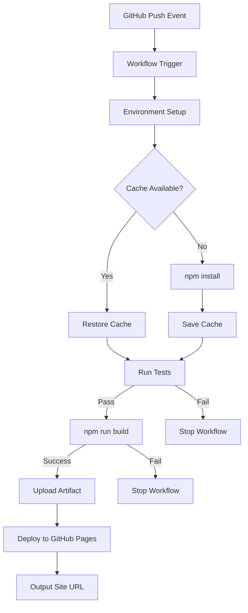
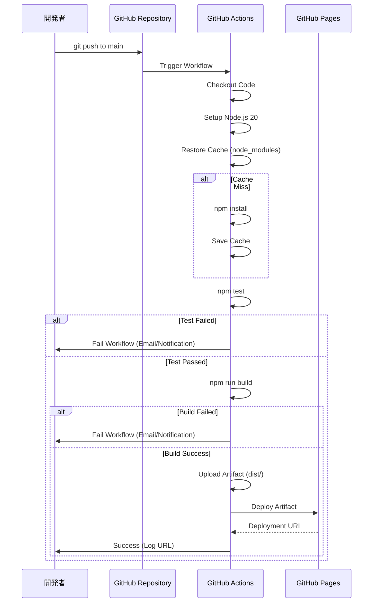

# Design Document

## Overview
本機能は、GitHub Actionsを使用してVite+TypeScriptプロジェクトの自動ビルドとGitHub Pagesへのデプロイを実現するCI/CDワークフローを提供します。mainブランチへのコード変更時に自動的にテスト・ビルドが実行され、成功時にはGitHub Pages Artifactを通じて静的サイトが公開されます。

**Purpose**: 手動デプロイの手間を排除し、コード変更から本番公開までの時間を短縮することで、継続的デリバリーを実現する。

**Users**: 開発者がコードをpushすると自動的にデプロイが実行され、エンドユーザーは常に最新版のサイトにアクセスできる。

**Impact**: 既存のプロジェクトに`.github/workflows/`ディレクトリと1つのYAMLファイルを追加。既存コードへの影響はなし。

### Goals
- mainブランチへのpush時に自動的にビルド・デプロイを実行
- テスト失敗時はデプロイをスキップし、品質を保証
- GitHub Pages公式アクションを使用した安全なデプロイ
- キャッシュによるビルド時間の最適化

### Non-Goals
- 複数環境(staging, production)へのデプロイ
- ブランチ戦略(feature branchからのデプロイ等)の管理
- カスタムドメインの設定
- ロールバック機能の実装

## Architecture

### Architecture Pattern & Boundary Map

**Architecture Integration**:
- **Selected pattern**: GitHub Actions Declarative Workflow — YAMLによる宣言的なCI/CDパイプライン定義
- **Domain boundaries**:
  - Workflow Trigger Layer — イベント検知とワークフロー起動
  - Build & Test Layer — 依存関係管理、テスト実行、ビルド成果物生成
  - Deployment Layer — GitHub Pages Artifactアップロードとデプロイ
- **Rationale**: GitHub Actionsのネイティブ機能を最大限活用し、外部ツール依存を最小化。シンプルな直線的パイプラインで理解しやすく保守性が高い
- **Steering compliance**: tech.mdの静的サイトデプロイ要件に準拠



### Technology Stack

| Layer | Choice / Version | Role in Feature | Notes |
|-------|------------------|-----------------|-------|
| CI/CD Platform | GitHub Actions | ワークフロー実行環境 | GitHub統合、無料枠利用可能 |
| Runtime | Node.js 20.x | ビルド環境 | actions/setup-nodeで管理 |
| Build Tool | Vite 7.x | 静的ファイル生成 | package.jsonから自動検出 |
| Test Runner | Vitest 4.x | テスト実行 | package.jsonから自動検出 |
| Deployment | actions/upload-pages-artifact@v3, actions/deploy-pages@v4 | GitHub Pages Artifact方式 | 公式推奨アクション |
| Cache | actions/cache@v4 | node_modulesキャッシュ | ビルド時間短縮 |

## System Flows

### デプロイフロー



**Key Decisions**:
- `actions/checkout@v4`でコード取得、`fetch-depth: 0`は不要(単一コミットのビルドで十分)
- テスト失敗時は即座にワークフロー停止、ビルドステップをスキップ
- GitHub Pages Artifact方式を採用し、`gh-pages`ブランチ管理を不要に
- デプロイURLは`${{ steps.deployment.outputs.page_url }}`から取得しログ出力

## Requirements Traceability

| Requirement | Summary | Components | Interfaces | Flows |
|-------------|---------|------------|------------|-------|
| 1.1, 1.2, 1.3 | 自動ビルドトリガー | Workflow Trigger | `on: push`, `on: workflow_dispatch` | デプロイフロー |
| 2.1, 2.2, 2.3, 2.4, 2.5 | 依存関係とビルド | Build Job | `actions/setup-node`, `npm install`, `npm run build` | デプロイフロー |
| 3.1, 3.2, 3.3 | テストの実行 | Test Step | `npm test` | デプロイフロー |
| 4.1, 4.2, 4.3, 4.4 | GitHub Pagesデプロイ | Deployment Job | `actions/upload-pages-artifact`, `actions/deploy-pages` | デプロイフロー |
| 5.1, 5.2, 5.3, 5.4 | ワークフロー設定ファイル配置 | deploy.yml | YAML定義 | なし |
| 6.1, 6.2, 6.3, 6.4 | 環境変数とパーミッション | Permissions Block | `permissions` YAML設定 | なし |
| 7.1, 7.2, 7.3, 7.4 | ビルドキャッシュ最適化 | Cache Step | `actions/cache@v4` | デプロイフロー |

## Components and Interfaces

### Component Summary

| Component | Domain/Layer | Intent | Req Coverage | Key Dependencies | Contracts |
|-----------|--------------|--------|--------------|------------------|-----------|
| deploy.yml | Workflow Definition | CI/CDパイプライン定義 | 全要件 | GitHub Actions API (P0) | Workflow [ x ] |
| build job | Build & Test | 依存関係管理、テスト、ビルド実行 | 2, 3, 7 | Node.js (P0), npm (P0), Vite (P0) | Job [ x ] |
| deploy job | Deployment | GitHub Pagesへのデプロイ | 4, 6 | build job (P0), GitHub Pages API (P0) | Job [ x ] |

### Workflow Definition Layer

#### deploy.yml

| Field | Detail |
|-------|--------|
| Intent | GitHub Actionsワークフローを定義し、トリガー条件、ジョブ、ステップを宣言的に記述 |
| Requirements | 1, 5 |

**Responsibilities & Constraints**
- ワークフローのトリガー条件を定義(push, workflow_dispatch)
- 2つのジョブ(build, deploy)を順次実行
- パーミッション設定を宣言
- トランザクションスコープ: 単一ワークフロー実行(atomicな成功/失敗)

**Dependencies**
- Inbound: GitHub Repository Events — push/workflow_dispatch (P0)
- Outbound: build job, deploy job — ジョブ実行 (P0)
- External: GitHub Actions API — ワークフロー実行基盤 (P0)

**Contracts**: Workflow [x]

##### Workflow Definition
```yaml
name: Deploy to GitHub Pages

on:
  push:
    branches: ["main"]
  workflow_dispatch:

permissions:
  contents: read
  pages: write
  id-token: write

concurrency:
  group: "pages"
  cancel-in-progress: false

jobs:
  build:
    # ビルドジョブ定義
  deploy:
    # デプロイジョブ定義
```

- **Preconditions**: リポジトリにpackage.json、vite.config.ts、dist/ディレクトリ生成可能な設定が存在
- **Postconditions**: 成功時はGitHub Pagesにデプロイ完了、失敗時はワークフロー停止
- **Invariants**: mainブランチへのpushは常にワークフローをトリガー

**Implementation Notes**
- **Integration**: `.github/workflows/deploy.yml`に配置、Gitでバージョン管理
- **Validation**: GitHub Actions UIでワークフロー構文を自動検証
- **Risks**: パーミッション不足時はデプロイ失敗(GitHub Pages設定でActions権限を有効化する必要あり)

### Build & Test Layer

#### build job

| Field | Detail |
|-------|--------|
| Intent | Node.js環境セットアップ、依存関係インストール、テスト実行、ビルド成果物生成 |
| Requirements | 2, 3, 7 |

**Responsibilities & Constraints**
- Node.js 20環境のセットアップ
- キャッシュ戦略による依存関係管理
- Vitestによるテスト実行とビルド前品質保証
- Viteビルドによるdist/ディレクトリ生成
- トランザクションスコープ: ステップ単位(失敗時は後続ステップスキップ)

**Dependencies**
- Inbound: Workflow Trigger — ジョブ起動 (P0)
- Outbound: deploy job — ビルド成果物提供 (P0)
- External: npm registry — 依存関係ダウンロード (P0)

**Contracts**: Job [x]

##### Job Steps Definition
```yaml
build:
  runs-on: ubuntu-latest
  steps:
    - name: Checkout
      uses: actions/checkout@v4

    - name: Setup Node.js
      uses: actions/setup-node@v4
      with:
        node-version: '20'
        cache: 'npm'

    - name: Install dependencies
      run: npm ci

    - name: Run tests
      run: npm test

    - name: Build
      run: npm run build

    - name: Upload artifact
      uses: actions/upload-pages-artifact@v3
      with:
        path: ./dist
```

- **Preconditions**: package.json、package-lock.json、tsconfig.json、vite.config.tsが存在
- **Postconditions**: dist/ディレクトリがGitHub Pages Artifactとしてアップロード済み
- **Invariants**: テスト失敗時はビルドステップを実行しない

**Implementation Notes**
- **Integration**: `npm ci`で決定的な依存関係インストール(package-lock.json使用)
- **Validation**: テスト失敗時は`npm run build`をスキップし、ワークフロー全体が失敗
- **Risks**: npm registryのダウンタイム(キャッシュでリスク軽減)、Viteビルドエラー(ローカルビルド成功を事前確認)

### Deployment Layer

#### deploy job

| Field | Detail |
|-------|--------|
| Intent | GitHub Pages Artifactをデプロイし、公開URLを出力 |
| Requirements | 4, 6 |

**Responsibilities & Constraints**
- build jobの成功を待機(needs: build)
- GitHub Pages Artifactをデプロイ
- デプロイURLをワークフローログに出力
- トランザクションスコープ: デプロイ操作全体(成功/失敗はatomic)

**Dependencies**
- Inbound: build job — ビルド成果物(Artifact) (P0)
- Outbound: なし
- External: GitHub Pages API — デプロイ実行 (P0)

**Contracts**: Job [x]

##### Job Definition
```yaml
deploy:
  environment:
    name: github-pages
    url: ${{ steps.deployment.outputs.page_url }}
  runs-on: ubuntu-latest
  needs: build
  steps:
    - name: Deploy to GitHub Pages
      id: deployment
      uses: actions/deploy-pages@v4
```

- **Preconditions**: build jobが成功、GitHub Pages Artifactが存在、リポジトリ設定でGitHub Pages有効
- **Postconditions**: GitHub Pagesにデプロイ完了、URLが`${{ steps.deployment.outputs.page_url }}`に格納
- **Invariants**: build job失敗時はdeploy jobを実行しない

**Implementation Notes**
- **Integration**: `needs: build`で依存関係を宣言、build失敗時はスキップ
- **Validation**: GitHub Pages設定でSourceを"GitHub Actions"に設定する必要あり
- **Risks**: GitHub Pages APIのレート制限(通常のプロジェクトでは影響なし)、初回デプロイ時の遅延(数分)

## Data Models

### Domain Model

本機能はワークフロー定義のみで、永続化データモデルは持たない。以下の一時的なデータ構造を扱う:

**Workflow State** (GitHub Actions内部管理):
- ワークフロー実行ID
- ジョブステータス(pending, in_progress, success, failure)
- ステップ出力(artifact ID, deployment URL)

**Artifact** (GitHub Pages Artifact):
- ビルド成果物(dist/ディレクトリの内容)
- Artifactメタデータ(サイズ、作成日時、保持期間)

**Business Rules**:
- テスト失敗時はビルド・デプロイを実行しない
- build job成功時のみdeploy jobを実行
- 同時デプロイを防止(concurrency: pages)

## Error Handling

### Error Strategy
ワークフロー実行時のエラーは即座にワークフローを停止し、GitHub ActionsのUIとメール通知でエラーを報告。リトライは手動またはコード修正後の再pushで実施。

### Error Categories and Responses

**User Errors (開発者起因)**:
- **テスト失敗**: ワークフロー停止、ログにテスト結果を出力、開発者がコード修正してre-push
- **ビルドエラー**: ワークフロー停止、Viteエラーメッセージをログ出力、ローカルで`npm run build`成功を確認後に修正
- **構文エラー**: YAML構文エラー時はGitHub ActionsがWorkflow起動前にエラー表示

**System Errors (インフラ起因)**:
- **npm registry障害**: 依存関係インストール失敗、キャッシュがあれば軽減、なければリトライ待機
- **GitHub Pages API障害**: デプロイ失敗、GitHub Statusページで確認、復旧後に手動リトライ
- **Runner障害**: GitHub Actions Runner起動失敗、自動リトライまたは手動re-trigger

**Permission Errors**:
- **不足パーミッション**: `permissions`ブロックが不足している場合、デプロイステップで失敗、エラーメッセージで不足権限を明示

### Monitoring
- GitHub Actions UIでワークフロー実行履歴を確認
- メール通知で失敗時にアラート
- ワークフローログで各ステップの出力を追跡

## Testing Strategy

### Workflow Validation
- **YAML構文検証**: GitHub ActionsのUI上で自動検証、pushする前にローカルで`yamllint`使用可能
- **ドライラン**: `workflow_dispatch`で手動トリガーし、初回デプロイ前に動作確認
- **Secrets/Permissions**: ローカルでは再現不可、実際のリポジトリでテスト実行が必要

### Integration Tests
- **ビルド成果物検証**: dist/ディレクトリにindex.html、assets/が含まれることを確認(ローカルビルドで事前確認)
- **デプロイ成功確認**: GitHub Pages URLにアクセスし、期待通りのコンテンツが表示されることを確認
- **キャッシュ動作確認**: 2回目の実行でキャッシュが利用され、ビルド時間が短縮されることをログで確認

### E2E Tests
- **mainブランチpush**: 実際にコードをpushし、ワークフローが自動トリガーされることを確認
- **PR merge**: PRをmainにマージし、ワークフローが実行されることを確認
- **手動トリガー**: GitHub Actions UIから`workflow_dispatch`で手動実行が可能なことを確認

### Performance
- **初回ビルド時間**: キャッシュなしで約2-3分(依存関係インストール含む)
- **2回目以降ビルド時間**: キャッシュ利用で約1分以内(テスト+ビルドのみ)
- **デプロイ時間**: Artifact方式で約30秒-1分

## Optional Sections

### Security Considerations

**Authentication and Authorization**:
- `GITHUB_TOKEN`を使用してGitHub Pages APIにアクセス、Secretsは不要
- `permissions`ブロックで最小権限原則を適用(`contents: read`, `pages: write`, `id-token: write`)

**Data Protection**:
- ビルド成果物(dist/)は公開静的サイトのため機密情報を含まない
- 環境変数やSecretsはワークフロー内で使用しない(すべてビルド時に静的ファイル化)

**Dependency Security**:
- `npm ci`で決定的なバージョンインストール
- 定期的な依存関係更新(Dependabot推奨)

### Performance & Scalability

**Target Metrics**:
- ワークフロー実行時間: < 3分(初回)、< 1分(キャッシュ利用時)
- デプロイ頻度: 無制限(GitHub Actionsの無料枠: 2000分/月)

**Optimization Techniques**:
- `actions/cache@v4`でnode_modulesキャッシュ
- `npm ci`で決定的なインストール(npm installより高速)
- `concurrency: pages`で同時デプロイを防止し、リソース競合を回避

**Scalability**:
- GitHub Actionsのスケーラビリティに依存、単一リポジトリのワークフローは十分にスケール
- 複数ブランチからのデプロイが必要な場合は、環境ごとにワークフローを分離
