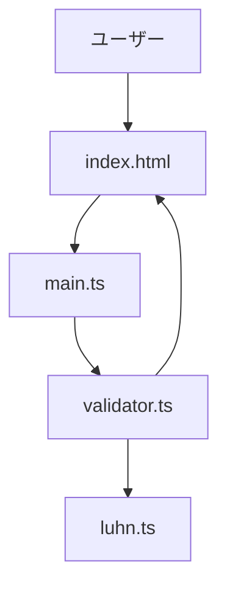
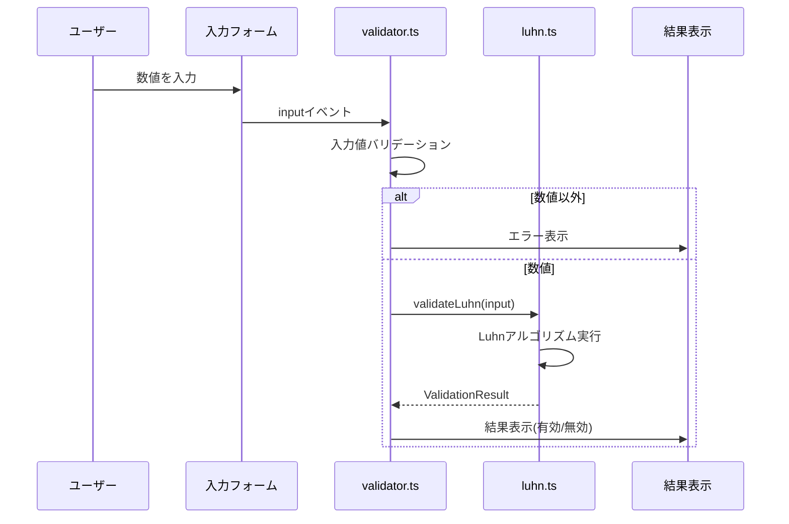

# Design Document

## Overview
本機能は、Luhnアルゴリズムの学習と検証を目的としたシングルページWebアプリケーションを提供する。ユーザーはアルゴリズムの解説を読みながら、リアルタイムで任意の数値の検証を試すことができる。すべての処理はクライアントサイドで完結し、サーバー通信は不要。

**Purpose**: Luhnアルゴリズムの教育的理解と実践的検証を統合した学習体験を提供する。

**Users**: Luhnアルゴリズムを学びたい開発者、学生、クレジットカード番号などの検証ロジックに興味のあるユーザー。

**Impact**: 新規機能の追加(既存システムへの変更なし)。

### Goals
- Luhnアルゴリズムのわかりやすい解説コンテンツを提供
- リアルタイムで数値検証を実行できるインタラクティブなUI
- シングルページ構成でシームレスな学習体験を実現
- 静的ファイルのみで動作する軽量なアプリケーション

### Non-Goals
- サーバーサイドでの検証機能
- ユーザー認証やデータ永続化
- モバイルアプリ版の提供
- 複数ページへの拡張

## Architecture

### Architecture Pattern & Boundary Map

**Architecture Integration**:
- **Selected pattern**: Simple Module Pattern — 機能ごとにモジュール分離し、依存関係を最小化
- **Domain boundaries**:
  - Pure Logic Layer (`luhn.ts`) — アルゴリズムの計算ロジック、DOM依存なし
  - UI Layer (`validator.ts`) — DOM操作とイベントハンドリング
  - Application Layer (`main.ts`) — アプリケーション初期化とモジュール統合
- **Rationale**: 小規模SPAに最適なシンプルさ、テスタビリティ、保守性を両立。教育目的に適した透明性の高い構成
- **Steering compliance**: tech.mdの推奨構成に準拠



### Technology Stack

| Layer | Choice / Version | Role in Feature | Notes |
|-------|------------------|-----------------|-------|
| Frontend | TypeScript 5.x | 型安全なロジック実装 | noImplicitAny: true、strict: false |
| Build Tool | Vite 5.x | 開発サーバーとビルド | HMR対応、高速ビルド |
| Styling | Tailwind CSS 4.x | ユーティリティファーストCSS | 固定配置フォーム、レスポンシブデザイン |
| Runtime | Modern Browsers | ES2020+実行環境 | Chrome, Firefox, Safari, Edge |

詳細な調査結果と選定理由は`research.md`の「Vite + TypeScript + Tailwind CSS プロジェクト構成」を参照。

## System Flows

### リアルタイム検証フロー



**Key Decisions**:
- `input`イベントを使用してリアルタイム検証を実現
- バリデーションはvalidator層で実施し、純粋なロジックとUI処理を分離
- 非同期処理は不要(すべて同期処理)

## Requirements Traceability

| Requirement | Summary | Components | Interfaces | Flows |
|-------------|---------|------------|------------|-------|
| 1.1, 1.2, 1.3, 1.4 | Luhnアルゴリズム解説コンテンツ | index.html | 静的HTMLコンテンツ | なし |
| 2.1, 2.2, 2.3, 2.4 | 検証対象値入力フォーム | validator.ts, luhn.ts | ValidatorService, LuhnService | リアルタイム検証フロー |
| 3.1, 3.2, 3.3 | 入力フォームのUI配置とスクロール追随 | index.html, validator.ts | 固定配置UI (Tailwind) | なし |
| 4.1, 4.2, 4.3, 4.4 | クライアントサイド実装 | すべてのコンポーネント | 型定義、静的ビルド | なし |
| 5.1, 5.2, 5.3 | シングルページ構成 | index.html, main.ts | Application初期化 | なし |

## Components and Interfaces

### Component Summary

| Component | Domain/Layer | Intent | Req Coverage | Key Dependencies | Contracts |
|-----------|--------------|--------|--------------|------------------|-----------|
| luhn.ts | Pure Logic | Luhnアルゴリズム計算ロジック | 2.1, 2.2, 4.1, 4.2 | なし (P0) | Service [x] |
| validator.ts | UI Layer | DOM操作とリアルタイム検証 | 2.1, 2.2, 2.3, 2.4, 3.1, 3.2, 3.3 | luhn.ts (P0), DOM API (P0) | Service [x], State [x] |
| main.ts | Application | アプリケーション初期化 | 5.1, 5.2, 5.3 | validator.ts (P0) | - |
| index.html | Presentation | 静的コンテンツとUI構造 | 1.1, 1.2, 1.3, 1.4, 3.1, 5.1 | Tailwind CSS (P0) | - |

### Pure Logic Layer

#### luhn.ts

| Field | Detail |
|-------|--------|
| Intent | Luhnアルゴリズムの計算ロジックを提供する純粋関数モジュール |
| Requirements | 2.1, 2.2, 4.1, 4.2 |

**Responsibilities & Constraints**
- Luhnアルゴリズムの検証ロジックを実装
- 入力文字列から数値配列への変換と検証
- DOM依存なし、純粋関数として実装
- トランザクションスコープ: 単一関数実行(同期処理)

**Dependencies**
- Inbound: validator.ts — 検証リクエスト (P0)
- Outbound: なし
- External: なし

**Contracts**: Service [x]

##### Service Interface
```typescript
interface LuhnService {
  /**
   * Luhnアルゴリズムで数値文字列を検証
   * @param input - 検証対象の数値文字列
   * @returns 検証結果オブジェクト
   */
  validateLuhn(input: string): ValidationResult;

  /**
   * 数値配列のLuhnチェックサム計算
   * @param digits - 数値配列
   * @returns チェックサム値
   */
  calculateChecksum(digits: number[]): number;
}

type ValidationResult = {
  isValid: boolean;
  message: string;
};
```

- **Preconditions**: 入力は文字列型
- **Postconditions**: ValidationResult型のオブジェクトを返す
- **Invariants**: 純粋関数であり、同じ入力に対して常に同じ出力

**Implementation Notes**
- **Integration**: validator.tsからインポートして使用
- **Validation**: 入力文字列の数値チェックは呼び出し側(validator.ts)で実施
- **Risks**: 極端に長い入力文字列のパフォーマンス(軽微、教育目的では問題なし)

### UI Layer

#### validator.ts

| Field | Detail |
|-------|--------|
| Intent | 入力フォームのDOM操作とリアルタイム検証を管理 |
| Requirements | 2.1, 2.2, 2.3, 2.4, 3.1, 3.2, 3.3 |

**Responsibilities & Constraints**
- 入力イベントのリスナー登録と処理
- 入力値のバリデーション(数値チェック、空文字チェック)
- Luhnサービスの呼び出しと結果のUI反映
- エラーメッセージの表示制御

**Dependencies**
- Inbound: main.ts — 初期化リクエスト (P0)
- Outbound: luhn.ts — 検証ロジック (P0)
- External: DOM API — イベント処理とUI更新 (P0)

**Contracts**: Service [x], State [x]

##### Service Interface
```typescript
interface ValidatorService {
  /**
   * バリデーターを初期化し、イベントリスナーを設定
   * @param inputElement - 入力フォーム要素
   * @param resultElement - 結果表示要素
   */
  setupValidator(inputElement: HTMLInputElement, resultElement: HTMLElement): void;

  /**
   * 入力値をバリデーションして結果を表示
   * @param value - 入力値
   */
  handleInput(value: string): void;
}
```

##### State Management
- **State model**:
  - 入力値の現在の状態(valid/invalid/empty)
  - 検証結果メッセージ
- **Persistence & consistency**: 状態はメモリ内のみ、永続化なし
- **Concurrency strategy**: 単一スレッド実行、並行制御不要

**Implementation Notes**
- **Integration**: main.tsから`setupValidator`を呼び出してDOM要素をバインド
- **Validation**: 正規表現`/^\d+$/`で数値チェック、空文字は専用メッセージ
- **Risks**: 過度な入力イベント発火によるパフォーマンス低下(必要に応じてdebounce実装)

### Application Layer

#### main.ts

| Field | Detail |
|-------|--------|
| Intent | アプリケーションのエントリーポイント、モジュール初期化 |
| Requirements | 5.1, 5.2, 5.3 |

**Responsibilities & Constraints**
- DOMContentLoadedイベント待機
- DOM要素の取得とvalidator初期化
- アプリケーション全体のセットアップ

**Dependencies**
- Inbound: index.html — スクリプト読み込み (P0)
- Outbound: validator.ts — バリデーター初期化 (P0)
- External: DOM API — 要素取得 (P0)

**Implementation Notes**
- **Integration**: `<script type="module" src="/src/main.ts"></script>`でindex.htmlから読み込み
- **Validation**: DOM要素が存在しない場合はエラーログ出力
- **Risks**: DOM要素IDの不一致(開発時の目視確認で対処)

### Presentation Layer

#### index.html

シングルHTMLファイルで解説コンテンツと検証フォームを提供。詳細なマークアップ構造は実装時に決定。

**Implementation Notes**
- **固定フォーム配置**:
  - デスクトップ: `fixed top-4 right-4 bg-white shadow-lg p-6 rounded-lg`
  - モバイル: `fixed bottom-0 w-full bg-white shadow-lg p-4` (レスポンシブブレークポイント使用)
- **解説コンテンツ**: Luhnアルゴリズムの概要、計算手順、実用例をセクション分けして配置
- **アクセシビリティ**: 固定フォームが解説コンテンツを隠さないようz-index調整

## Data Models

### Domain Model

本アプリケーションは単純なステートレス検証機能のため、複雑なドメインモデルは不要。

**Value Objects**:
```typescript
type ValidationResult = {
  isValid: boolean;    // 検証結果(true: 有効, false: 無効)
  message: string;     // ユーザー向けメッセージ
};
```

**Business Rules**:
- Luhnアルゴリズムのチェックサム計算ルール
- 数値以外の入力は検証不可
- 空文字は検証対象外

## Error Handling

### Error Strategy
バリデーションエラーは例外をスローせず、ValidationResultで表現。ユーザーに明確なフィードバックを提供。

### Error Categories and Responses

**User Errors (バリデーションエラー)**:
- **空文字入力**: "数値を入力してください" — 入力を促すメッセージ表示
- **非数値入力**: "数値のみを入力してください" — 正規表現`/^\d+$/`でチェック、エラーメッセージ表示
- **Luhn検証失敗**: "無効な数値です" — アルゴリズム結果に基づく表示

**System Errors** (想定外エラー):
- **DOM要素未発見**: コンソールエラーログ出力、アプリケーション初期化失敗を通知
- **ビルドエラー**: Viteのエラー表示機能で開発時に検出

### Monitoring
本アプリケーションは静的サイトのため、サーバーサイドのモニタリングは不要。ブラウザコンソールでクライアント側エラーを確認。

## Testing Strategy

### Unit Tests
- `luhn.ts`の`validateLuhn`関数: 有効な数値、無効な数値、空文字、非数値のテストケース
- `luhn.ts`の`calculateChecksum`関数: 既知のチェックサム値との一致確認
- `validator.ts`の入力バリデーション: 正規表現による数値チェックのテスト

### Integration Tests
- `validator.ts`と`luhn.ts`の統合: 入力から結果表示までのフロー確認
- DOM操作のテスト: JSDOM環境でのイベント発火と結果反映

### E2E/UI Tests
- リアルタイム検証フロー: ブラウザで数値入力→即座に結果表示を確認
- 固定フォームのスクロール追随: ページスクロール時にフォームが追随することを確認
- レスポンシブ対応: デスクトップとモバイルでのフォーム配置変更を確認

### Performance
- バンドルサイズ: 目標 < 100KB (Viteのビルド分析で確認)
- 検証レスポンス: 入力イベントから結果表示まで < 100ms (ブラウザDevToolsで計測)

## Optional Sections

### Performance & Scalability

**Target Metrics**:
- 初回ロード時間: < 2秒 (3G接続)
- バンドルサイズ: < 100KB (gzip圧縮後)
- リアルタイム検証レスポンス: < 100ms

**Optimization Techniques**:
- Viteのツリーシェイキングで未使用コード削除
- Tailwind CSSのPurge機能で未使用スタイル削除
- 必要に応じてLuhnアルゴリズムにルックアップテーブル最適化を適用(research.md参照)

**Scalability**:
本アプリケーションは静的サイトのため、スケーラビリティは配信インフラ(CDN)に依存。アプリケーション自体のスケーリングは不要。

### Security Considerations

**Input Validation**:
- クライアントサイドで数値のみを受け入れる厳密なバリデーション
- XSS対策: ユーザー入力をそのままDOMに挿入しない、textContentを使用

**Data Protection**:
- 個人情報やセンシティブデータの取り扱いなし
- サーバー通信なし、データ永続化なし

**Compliance**:
本アプリケーションは教育目的のため、特定のコンプライアンス要件(GDPR, PCI DSS等)は該当しない。
